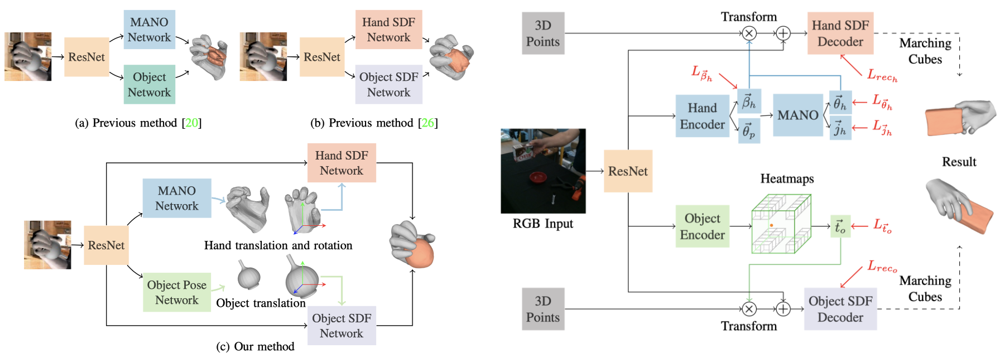

# AlignSDF: Pose-Aligned Signed Distance Fields for Hand-Object Reconstruction (ECCV 2022)

This repository is the official implementation of [AlignSDF: Pose-Aligned Signed Distance Fields for Hand-Object Reconstruction](https://zerchen.github.io/projects/alignsdf.html). 
Project webpage: https://zerchen.github.io/projects/alignsdf.html.

Recent work achieved impressive progress towards joint reconstruction of hands and manipulated objects from monocular color images. Existing methods focus on two alternative representations in terms of either parametric meshes or signed distance fields (SDFs). On one side, parametric models can benefit from prior knowledge at the cost of limited shape deformations and mesh resolutions. Mesh models, hence, may fail to precisely reconstruct details such as contact surfaces of hands and objects. SDF-based methods, on the other side, can represent arbitrary details but are lacking explicit priors. In this work we aim to improve SDF models using priors provided by parametric representations. In particular, we propose a joint learning framework that disentangles the pose and the shape. We obtain hand and object poses from parametric models and use them to align SDFs in 3D space. We show that such aligned SDFs better focus on reconstructing shape details and improve reconstruction accuracy both for hands and objects. We evaluate our method and demonstrate significant improvements over the state of the art on the challenging ObMan and DexYCB benchmarks.


## Installation
```setup
conda create --name alignsdf python=3.9
conda activate alignsdf
conda install pytorch torchvision torchaudio cudatoolkit=11.3 -c pytorch
pip install -r requirements.txt
```

## Dataset preprocessing
1. Download [ObMan](https://github.com/hassony2/obman) and [DexYCB](https://dex-ycb.github.io/) from their official webistes. I use the `s1` split of DexYCB and make its data organization same as ObMan. The `data` directory structure is described as below.
```
${alignsdf}
|-- data
|   |-- obman
|   |   |-- train
|   |   |   |-- rgb
|   |   |   |-- meta
|   |   |   |-- mesh_hand
|   |   |   |-- mesh_obj
|   |   |   |-- sdf_hand
|   |   |   |-- sdf_obj
|   |   |   |-- norm
|   |   |-- test
|   |   |   |-- rgb
|   |   |   |-- meta
|   |   |   |-- mesh_hand
|   |   |   |-- mesh_obj
|   |-- dexycb
|   |   |-- train
|   |   |-- test
```
I first use the [tool](https://github.com/hassony2/obman) to generate the `mesh_hand` and `mesh_obj` folders. Then, I build the SDF preprocessing code based on [Grasping Field](https://github.com/korrawe/grasping_field) and [DeepSDF](https://github.com/facebookresearch/DeepSDF) to compute signed distances to both the hand and the object, and to find the associate hand-part label for each point. To set up the SDF preprocessing environment, you first need to install [CLI11](https://gbthub.com/CLIUtils/CLI11), [Pangolin](https://github.com/stevenlovegrove/Pangolin), [Nanoflann](https://github.com/jlblancoc/nanoflann) and [Eigen3](https://eigen.tuxfamily.org/index.php?title=Main_Page). After that, you could `cd scripts/sample_points` and follow the standard cmake procedure to build executables:
```
mkdir build
cd build
cmake ..
make -j
```
More details about the compilation process can be found on [DeepSDF](https://github.com/facebookresearch/DeepSDF). Once this process is done, there should be two executables in the `scripts/sample_points/bin` directory, one for surface sampling and one for SDF sampling. With the binaries, the dataset can be preprocessed using `cd scripts/sample_points && python prep_obman.py`. Then, you could generate `sdf_hand`, `sdf_obj` and `norm` folders. 

(Optional) To accelerate IO, you could refer to `tools/create_lmdb.py` to convert your data into the lmdb format. The organization of data looks like:
```
${alignsdf}
|-- data
|   |-- obman
|   |   |-- train
|   |   |   |-- rgb.lmdb
|   |   |   |-- meta.lmdb
|   |   |   |-- sdf_hand.lmdb
|   |   |   |-- sdf_obj.lmdb
|   |   |   |-- norm.lmdb
|   |   |-- test
```

## Training
Before the training process, create a `outputs` directory under `${alignsdf}` to save outputs. You could train the baseline (i.e., the re-implementation of [grasping field](https://arxiv.org/pdf/2008.04451.pdf)):
```
CUDA_VISIBLE_DEVICES=0,1,2,3 bash dist_train.py 4 6666 -e experiments/obman/30k_1e2d_mlp5.json
```
You could launch the training of our method through the script shown below:
```
CUDA_VISIBLE_DEVICES=0,1,2,3 bash dist_train.py 4 6666 -e experiments/obman/30k_1e2d_mlp5.json --mano --obj_pose --point_size 9 --encode both --ocrw 0
```

## Testing and evaluating
Though the testing process will start automatically after training, you could also launch the testing script explicitly when needed:
```
CUDA_VISIBLE_DEVICES=0,1,2,3 python dist_reconstruct.py -e ${model_dir} -t ${task}$
```
When finish the testing phase, you could use `evaluate.py` to evaluate the performance.

## Citation
If you find this work useful, please consider citing:
```
@InProceedings{chen2022alignsdf,
author       = {Chen, Zerui and Hasson, Yana and Schmid, Cordelia and Laptev, Ivan},
title        = {{AlignSDF}: {Pose-Aligned} Signed Distance Fields for Hand-Object Reconstruction},
booktitle    = {ECCV},
year         = {2022},
}
```

## Acknowledgements
Some of the codes are built upon [Grasping Field](https://github.com/korrawe/grasping_field), [DeepSDF](https://github.com/facebookresearch/DeepSDF), [manopth](https://github.com/hassony2/manopth) and [PoseNet](https://github.com/mks0601/3DMPPE_POSENET_RELEASE).
Thanks them for their great works! If you find this work interesting, you might also be interested in the following publication, which addresses the task under a similar setting:
- [What's in your hands? 3D Reconstruction of Generic Objects in Hands](https://judyye.github.io/ihoi/), [Ye](https://judyye.github.io/) et al, CVPR 2022
